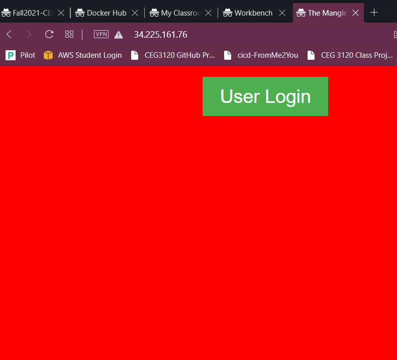

# Project Overview

This project will look into the use of containers. 
1. How to install the required software and dependencies.
2. How to build an container into an image from an Dockerfile or from an current compiled image.
3. Run a container as an interactive shell or an detached service
4. View the container in an web browser

## Install Docker

sudo apt update

sudo apt-get install docker-ce docker-ce-cli containerd.io

## Build a container
sudo docker build -t imagename:imageversion directoryofdockerfile

**Example**:
sudo docker build -t coolWebsite:1.0 .

**Note**: . is current working directory

This creates an image called coolWebsite Version 1.0.
It looks in the current directory for a Dockerfile and uses it to create the image

## Run a container
sudo docker run -it --name containername originalcontainername:containerversion

**Example**:
sudo docker run -it --name coolwebserver coolWebsite:1.0

**Note**: Running container for a webserver with a port unintended

sudo docker run -dit --name containername -p 8080:80 -v /home/ubuntu/cicd ubuntu

## View in web browser

Type in search bar, type localhost:8080 or private/publicip:8080

# DockerHub

## Create a public repository

After logging into your account, click "Repositories", "Create Repository"

Put in the name of the new repository

Select either public or private visibility

Click the "create" button

## DockerHub CLI

In the terminal, type "docker login --username username"

Enter the password of your DockerHub account

                    or

The authentication token created through your account

To create authentication token, click your account name

"Account Setting", "Security".

Click "Create Access Token"

Type a Description for the token, select the permissions for this token, then click "Create"

You will need to copy the token because it will not appear again

Sign into your account on Github.com. In the GitHub repo that will be connected to Docker, go to settings, secrets.

Click "Add new Secret".

Create one secret labeled "DOCKERHUB_USERNAME", type your DockerHub username

Create a second secret labeled two different ways:
1. "DOCKERHUB_PASSWORD" and type in the password of your account
2. "DOCKERHUB_ACCESS_TOKEN" and paste the access token that Dockerhub provided for you

## GitHub Workflow

In the same github account, click "Actions", "New Workflow", "Create a workflow yourself"

Make sure the DOCKER_HUB_REPO environment variable is set to your DockerHub repo that it will upload to

runs-on is set on the operating system the image will be installed with

User credentials
- Username: secret name with the username
- Password: secret name with account password or access token

Tags at the end will pass the docker username and repo as a tag to prevent exposure

${{ secrets.DOCKER_USERNAME }}/${{ env.DOCKER_HUB_REPO }}:latest

# Part 3

sudo docker pull fromme2you/ceg3120project6:latest

sudo docker run -dit --name ownwebserver -p 80:80 fromme2you/ceg3120project6:latest

Screenshot

